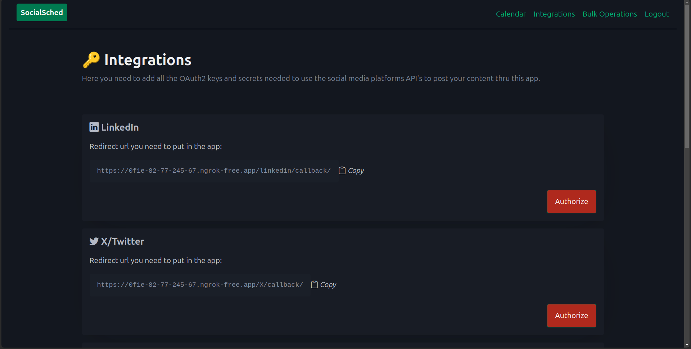
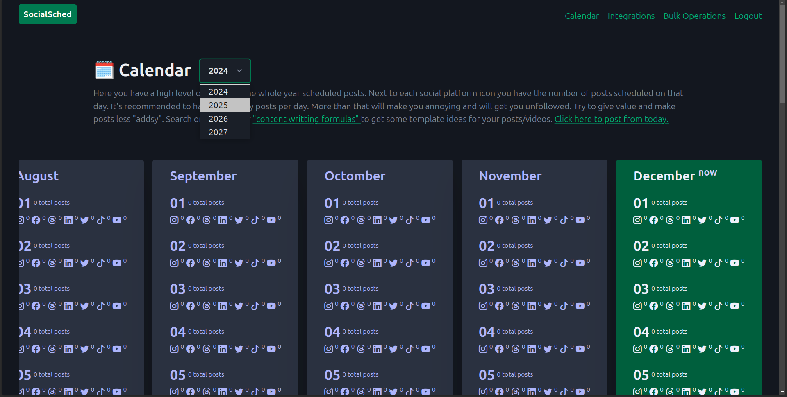
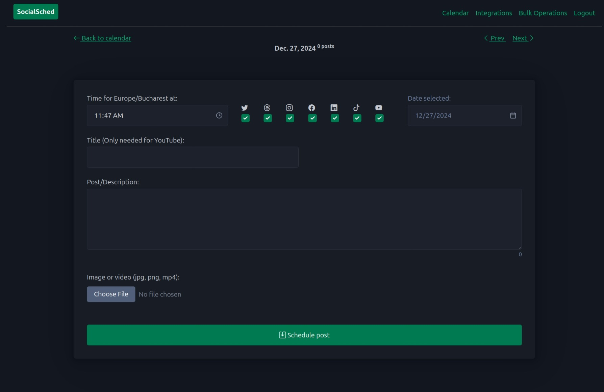
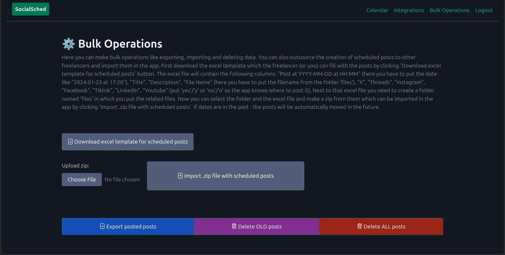

# Social Media Posts Scheduler

A simple social media posts scheduler. Built with Django and AlpineJs.

## Get social media OAuth2 ids and secrets

For all of them you need to search for developer + X or developer + Linkedin etc. to go to the platform where you can create an app and get the keys needed for integrating with their api. Search for "How to make posts via Linkedin/X/Facebook/etc api" you will find some up to date docs on what steps you need to take. Check .env.example for the needed ids and secrets.

## Quickstart

Using [pdm](https://pdm-project.org/latest/) for managing dependencies.

Migrations:
- `make migrate-all`;
- `make purge-db`;
- `make purge-migration-dirs`;

Run the application:
- `make web` - start web app (open browser at `http://localhost:8000/`);
- `make cron` - start post scheduler;

## Usage

Go to integrations and authorize app to post. Use ngrok during development (add redirect oauth2 urls on developer portals).

Plan content up to 3 years ahead. 

Add post text and media file (image), set time on which this post should be published. 
Click `Next` to go to the next day and post.

Externalize writing posts via an excel file which you can import. Delete all posts or old posts to free up disk space.

## Google SignIn Configuration

- Go to https://console.cloud.google.com/;
- Create a new project;
- Configure OAuth2 consent page;
- Setup Branding (name, support email, logo, app domain, authorized domain) - that's when app goes to prod;
- In Clients page click `Create client` button add name set authorized JS origins (http://localhost:8000 for dev, http://localhost:8000/complete/google-oauth2/ for dev redirect uri). Change it with your domain once app is ready for prod.
- Download secrets (you have later access to them as well);
- In the `.env` file fill `SOCIAL_AUTH_GOOGLE_OAUTH2_KEY` and `SOCIAL_AUTH_GOOGLE_OAUTH2_SECRET` with Cliend ID and Client Secret taken from previously downloaded json file with secrets;
